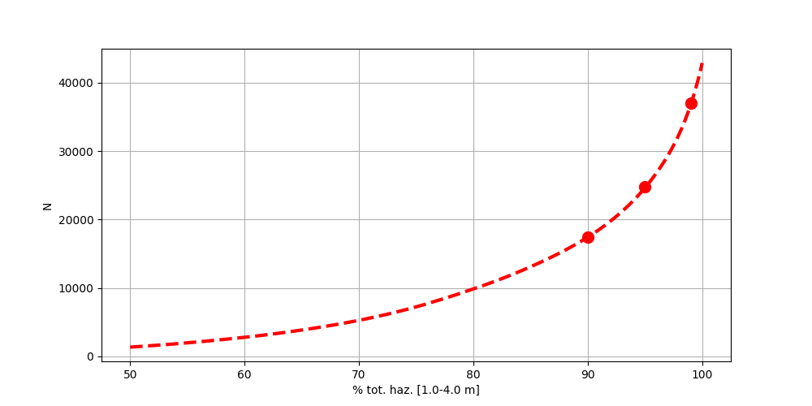
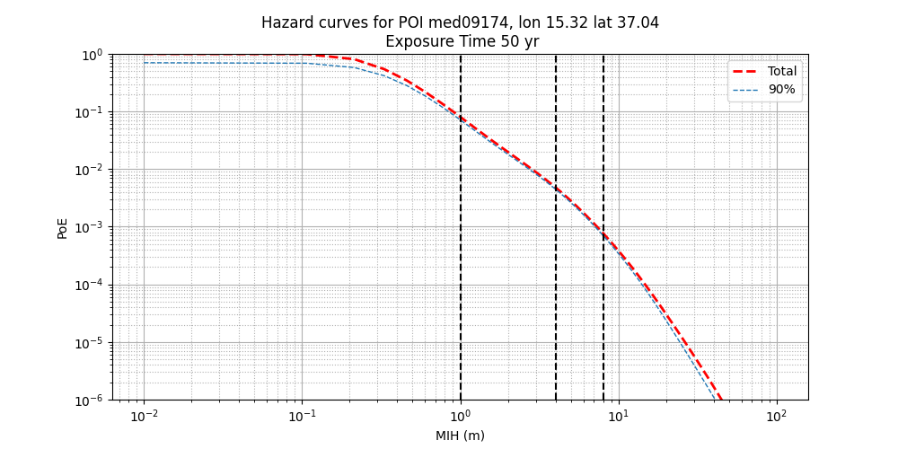

# **The disaggregation procedure**

This procedure selects, among all of the scenarios retrieved from <a href=../../steps/step2 target="_blank">STEP 2</a>, the most relevant ones for the target site, i.e. the scenarios that  most significantly contribute to the tsunami hazard at each offshore POI, within predefined MIH (Maximum Inundation Heights) intervals or thresholds and fixing the desired percentage of accuracy. It is based on the mean model of the epistemic uncertainty.

For each selected POI, the algorithm first ranks all the contributing scenarios for a given intensity, or intensity interval, according to their relative importance for the target site, measured as their relative contribution to the offshore hazard curve in terms of mean annual rates. Then, the scenarios are collected up to the desired “degree of accuracy” to which the local hazard should be approximated, defined in terms of the resemblance of the offshore hazard curve calculated using only the selected scenarios with respect to the original one. Of course, the level of accuracy must be chosen based on a trade-off between the type of application (i.e. a demonstrative or operational analysis) and the available computational resources, since increasing the percentage of the hazard reproduction may entail a noticeable increment in the number of selected scenarios, as illustrated for one POI in the following plot:

For example, we may want a list of those scenarios accounting for 90% of the total hazard within two MIH ranges, namely 1.0-4.0 m and 4.0-8.0 m. For a given POI, the comparison between the original offshore hazard curve and the new one computed from the selected scenarios would be

In this case, we observe that while we are able to acceptably reproduce the curve within the defined intervals, the tails are definetely underestimated, but more intervals could be used.

As another example, let's consider a disaggregation procedure carried out on a set of MIH thresholds (e.g. 0.3, 0.5, 1.0, 4.0, 8.0 m), aiming at reproducing the 99% of the total hazard. This high accuracy could be required by the PTHA assesment when critical infrastuctures are present or for the purpose of local planning. For a given POI, we can note that the entire hazard curve is well reproduced, although an underestimation is still observable at relatively low MIH, which are expected to be less significant for the subsequent tsunami calculations.

Anyway, the scenarios will be reweighted in the <a href=../../steps/step6 target="_blank"> hazard aggregation</a> step to preserve the total probability, so the risk of underestimation should be negligible.

For each POI, a separate output folder is created named `DISAGGREGATION_POIname`. Then, the lists are merged removing duplicates, and the net list of scenarios is saved in a new folder `DISAGGREGATION`.
