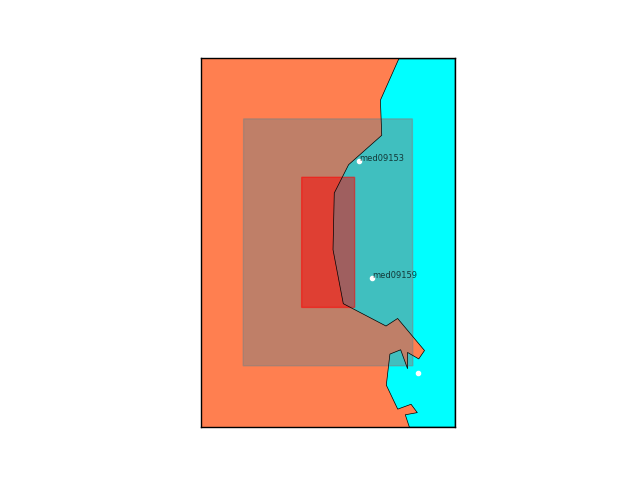

# **STEP 1: POI(s) selection**

The purpose of this step aims to select, from the <a href=../../background/neamthm18 target="_blank">NEAMTHM18</a> database, the POI(s) closest to the target site, to use the regional-scale offshore hazard curves as a proxy for the local assessment.

Three alternative options are available, depending on which information is provided in the <a href=../../instructions/json_input target="_blank">JSON input file</a>:

1. if the high-resolution inner grid is available and declared within the <a href=../../instructions/json_input target="_blank">JSON input file</a>, the grid domain is used to draw a rectangle, whose sides are then expanded by $X$ kilometers perpendicularly ($X=10$ km by default), in order to contain the coastlines around the target site; the POI(s) included in such a rectangular area are then selected

2. if the key "grdfile" in the <a href=../../instructions/json_input target="_blank">input file</a> is empty while the coordinates of the target site are provided, the rectangle is drawn by moving $\pm X^\circ$ from the site both vertically and horizontally ($X = 0.1^\circ$ by default) and then its sides are extended as before and the included POIs are selected;

3. if both the keys "grdfile" and "lonlat" are empty, the labels of the POIs are expected to be given by the user in the last field "poinames". The label of the POIs can be retrieved from the interactive tsunami hazard tool distributing the <a href=../../background/neamthm18 target="_blank">NEAMTHM18</a> regional model. This third option is mandatory in case of POI(s) outside the Mediterranean Sea.

The outputs of this step are text files with labels (\_POI_name.txt) and coordinates (\_ts.dat) of the selected POI(s). The last one is formatted to make the <a href=../../background/thysea target="_blank">HySEA code</a> save the time series at the POIs when running the tsunami simulations (<a href=../step5 target="_blank">Step 5</a>).
